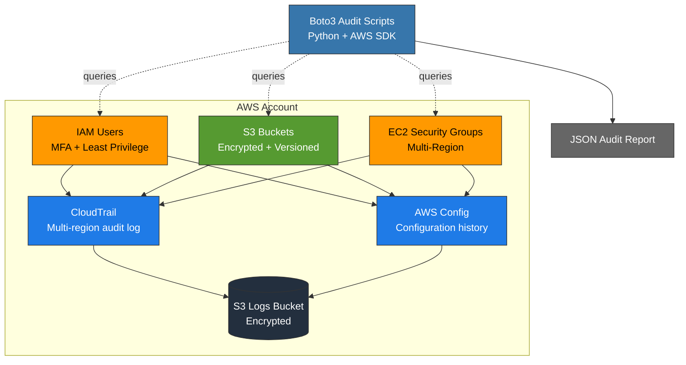

# AWS Cloud Security Hardening

A hands-on AWS security project that hardens a fresh account against common misconfigurations and validates the configuration with custom Python audits. Built as a portfolio piece while preparing for SOC analyst and cloud security roles.

## Overview

This project demonstrates end-to-end cloud security implementation on AWS:

- **IAM** — Root MFA, least-privilege admin user, separation of root from daily-use account
- **S3** — AES-256 default encryption, versioning, account-wide Block Public Access
- **Logging** — Multi-region CloudTrail with log file validation
- **Compliance** — AWS Config recording configuration changes across all supported resources
- **Automation** — Python audit scripts using Boto3 to detect misconfigurations across all regions
- **Validation** — Controlled detection self-test to verify script accuracy

## Architecture



## Audit Scripts

| Script | Purpose |
|---|---|
| `scripts/iam_audit.py` | Missing MFA, access keys >90d old, inactive consoles |
| `scripts/s3_audit.py` | Public access, encryption, versioning, access logging, wildcard policies |
| `scripts/security_groups_audit.py` | SSH/RDP open to internet, exposed databases, large port ranges — scans all regions |
| `scripts/full_audit.py` | Orchestrator — runs all audits, generates JSON report |

## Usage

### Prerequisites
- AWS account with admin IAM user (root not used for daily work)
- AWS CLI configured (`aws configure`)
- Python 3.10+

```bash
pip install -r requirements.txt
```

### Run an audit

```bash
cd scripts
python full_audit.py
```

Output:
- Console — executive summary with severity counts
- File — `docs/audit_report_YYYYMMDD_HHMMSS.json`
- Exit code — 0 (clean) or 1 (findings detected) for CI/CD integration

## Validation: Detection Self-Test

To verify the audit scripts catch what they claim to catch, I created an intentionally misconfigured security group with three classic real-world mistakes:

1. SSH (port 22) open to `0.0.0.0/0` — admin access exposed to the internet
2. MySQL (port 3306) open to `0.0.0.0/0` — database exposed directly to the internet
3. Port range 8000-9000 open to `0.0.0.0/0` — overly permissive bulk rule

I also tested adversarial edge cases that simpler checks would miss:

- A `/8` CIDR block (effectively public but not literally `0.0.0.0/0`)
- An S3 bucket policy with wildcard access granted via a `Condition` block
- An IAM user with `iam:PassRole` to a highly privileged role

The audit script correctly identified all findings with appropriate severity ratings, then verified the clean state after remediation. See `CIS_MAPPING.md` for the control-by-control breakdown.


## Sample Output

Full audit running against the hardened account:


JSON audit report (machine-readable, suitable for SIEM ingestion):


## Relationship to Existing Tooling

Tools like [Prowler](https://github.com/prowler-cloud/prowler), ScoutSuite, and CloudSploit already solve this problem at production scale. The goal of this project wasn't to compete with them — it was to learn Boto3, the AWS auth flow, and the underlying API shapes by rebuilding a narrow slice of what Prowler does from scratch. In a real environment I would run Prowler (or the equivalent AWS Config managed rules) alongside custom detections for organization-specific controls.

## Security Decisions and Trade-offs

- **AdministratorAccess on the admin group** — Used for lab simplicity. Production deployments should use scoped IAM policies following the principle of least privilege.
- **GuardDuty and Security Hub not enabled** — Both services offer free trials (GuardDuty: 30 days, Security Hub: free tier available), but I scoped this project to CloudTrail + AWS Config + custom Python detections to stay within the always-free tier and keep the focus on the detection engineering layer.
- **S3 access logging not enabled on all buckets** — Left as a known finding to demonstrate how the audit script triages real configuration gaps.

## CIS AWS Foundations Benchmark

See [`CIS_MAPPING.md`](CIS_MAPPING.md) for the control-by-control mapping between this project's checks and the CIS AWS Foundations Benchmark v1.4.

## Skills Demonstrated

- AWS service configuration via CLI (IAM, S3, CloudTrail, Config, EC2)
- Python automation using the Boto3 SDK
- JSON policy authoring (IAM trust policies, S3 bucket policies)
- Compliance frameworks (CIS AWS Foundations Benchmark v1.4)
- Detection engineering — controlled negative testing and adversarial edge cases
- Defensive scripting (no hardcoded credentials, pagination, error handling, multi-region)

## Author

**Vishwa Prakash Choudhary**
- Computer Science, UC Davis (graduating August 2026)
- vpc8848@gmail.com
- [GitHub](https://github.com/vchoudhary480)

<!-- GitHub topics to add via repo Settings: aws, security, boto3, cloud-security, cis-benchmark, python, iam, security-audit -->
