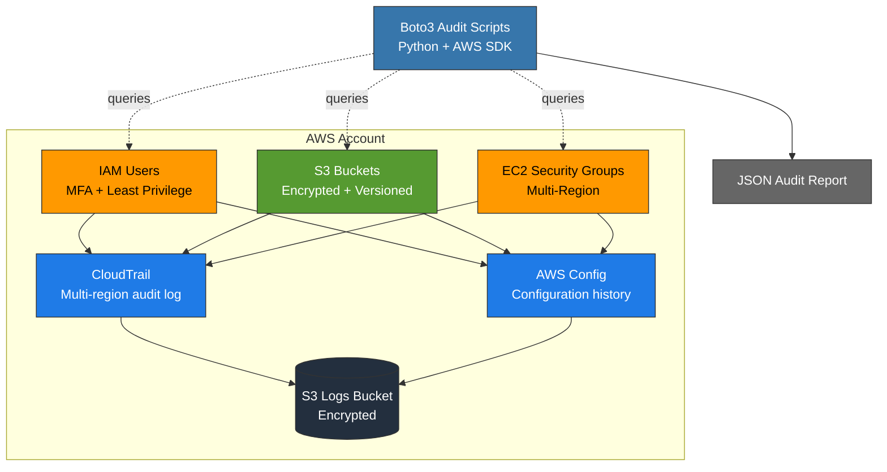
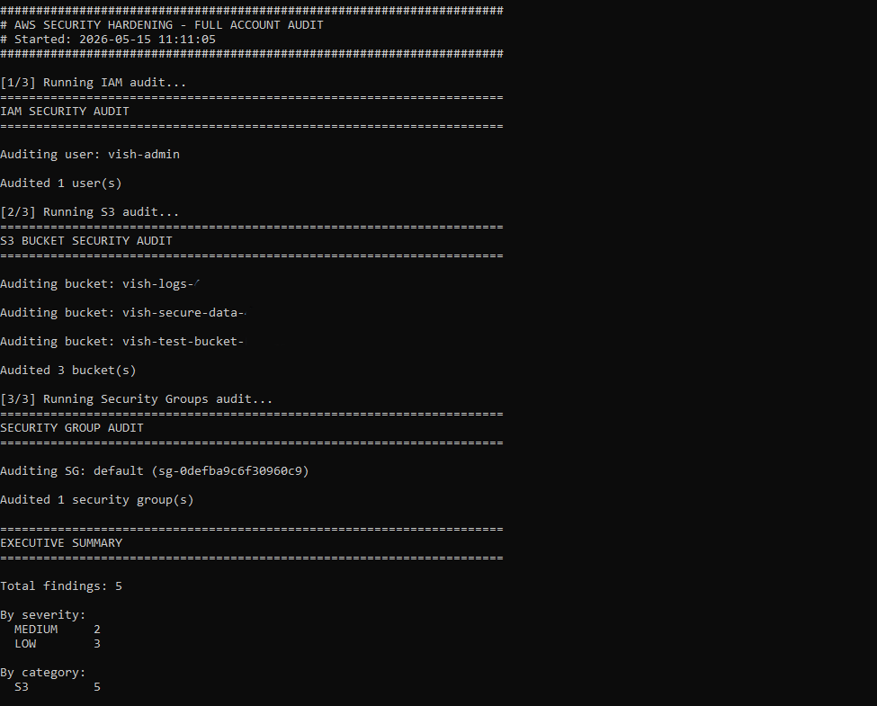
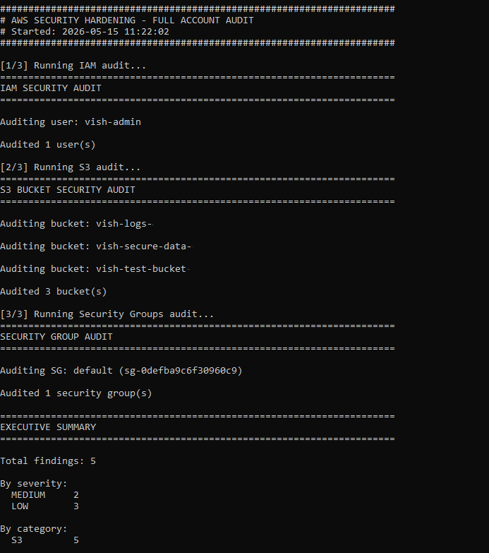
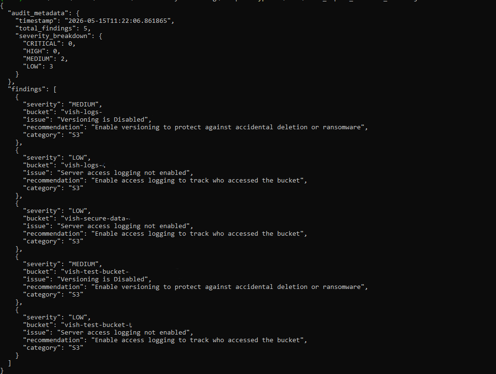

# AWS Cloud Security Hardening

Hardened a fresh AWS account against common misconfigurations and built Python scripts to detect them automatically. Built this to learn Boto3 and the underlying AWS API shapes while preparing for SOC analyst and cloud security roles.

## What this project does

I configured a real AWS account with proper IAM, S3, CloudTrail, and AWS Config settings, then wrote audit scripts that scan the account and flag anything misconfigured. The scripts produce a JSON report you can pipe into a SIEM or use as a CI/CD exit code gate.

The security group auditor scans every enabled AWS region, not just the default one. Real attackers spin up resources in obscure regions specifically because nobody looks there.

I also ran controlled detection tests to verify the scripts actually catch what they claim to catch, including edge cases like large CIDR blocks and wildcard S3 policies hidden behind condition blocks.

## Project layout

```
scripts/iam_audit.py              # missing MFA, stale access keys, inactive consoles
scripts/s3_audit.py               # public access, encryption, versioning, wildcard policies
scripts/security_groups_audit.py  # SSH/RDP/database ports open to the internet, all regions
scripts/full_audit.py             # runs all three, outputs JSON report
tests/                            # moto-based unit tests for all audit modules
CIS_MAPPING.md                    # maps each check to a CIS AWS Foundations Benchmark v1.4 control
```

## How to run it

```bash
pip install -r requirements.txt
cd scripts
python full_audit.py
```

Output:
- Console summary with severity counts
- `docs/audit_report_YYYYMMDD_HHMMSS.json` for SIEM ingestion
- Exit code 0 (clean) or 1 (findings detected) for CI/CD pipelines

## What it detects

**IAM**
- Users without MFA
- Access keys older than 90 days
- Console passwords unused for 90+ days

**S3**
- Missing block public access flags
- No default encryption
- Versioning disabled
- Access logging off
- Bucket policies with wildcard principals

**Security Groups (all regions)**
- SSH and RDP open to the internet
- Database ports exposed publicly (MySQL, PostgreSQL, Redis, MongoDB, and others)
- Overly large port ranges
- All-traffic rules

## Detection self-test

To verify the scripts catch what they claim, I created intentionally misconfigured resources and confirmed detection. I also tested adversarial edge cases that naive checks miss:

- A /8 CIDR block (not literally 0.0.0.0/0 but effectively public)
- An S3 policy granting wildcard access via a Condition block
- An IAM user with iam:PassRole to a privileged role

All findings were detected at the correct severity. Clean resources produced no false positives.

## Architecture



## Security decisions

- **AdministratorAccess on the admin group** — fine for a lab. Production would use scoped policies.
- **GuardDuty and Security Hub not enabled** — both have free trials, but I scoped this project to CloudTrail, AWS Config, and custom Python detections to stay within the always-free tier.
- **S3 access logging not enabled on all buckets** — left as a known finding to show how the script surfaces real gaps.

## Relationship to existing tools

Prowler, ScoutSuite, and CloudSploit already do this at production scale. The point of this project was to learn Boto3, the AWS auth flow, and the underlying API shapes by rebuilding a slice of what Prowler does from scratch. In a real environment I would run Prowler alongside custom detections for organization-specific controls.

## CIS benchmark mapping

See [CIS_MAPPING.md](CIS_MAPPING.md) for the full table mapping each check to a CIS AWS Foundations Benchmark v1.4 control number.

## Sample output

Vulnerable security group detection:



Full audit summary:



JSON report:



## Author

Vishwa Prakash Choudhary |
Computer Science, UC Davis |
vpc8848@gmail.com
